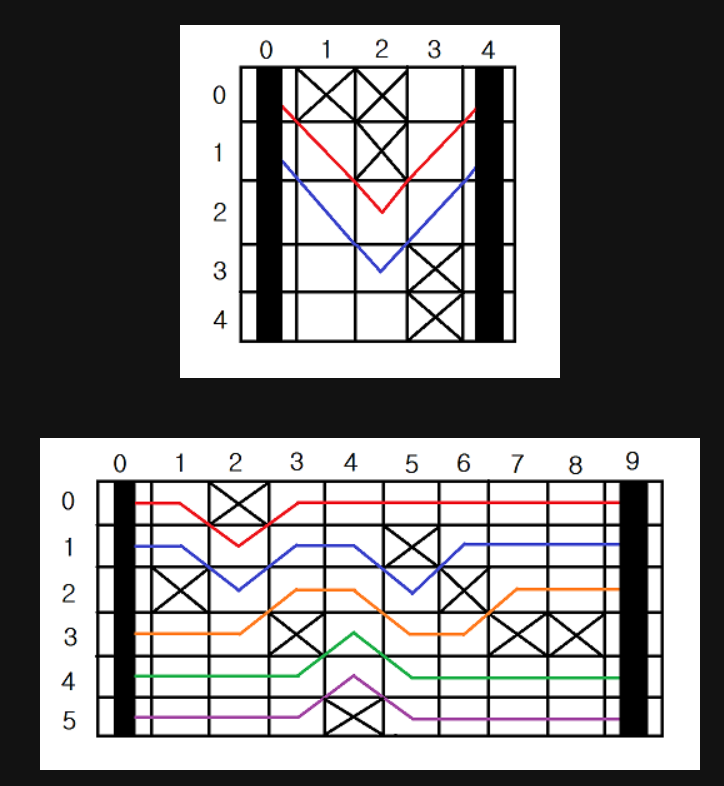

근처 빵집의 가스관에 몰래 파이프를 설치해 훔쳐서 사용

빵집이 있는 곳은 R*C 격자로 표현할 수 있다

첫째 열은 근처 빵집의 가스관이고, 마지막 열은 원웅이의 빵집

원웅이는 가스관과 빵집을 연결하는 파이프를 설치

빵집과 가스관 사이에는 건물이 있을 수도 있다

건물이 있는 경우에는 파이프를 놓을 수 없다

가스관과 빵집을 연결하는 모든 파이프라인은 첫째 열에서 시작 마지막 열에서 끝나야 한다. 

각 칸은 오른쪽, 오른쪽 위 대각선, 오른쪽 아래 대각선으로 연결할 수 있고, 각 칸의 중심끼리 연결

원웅이는 가스를 되도록 많이 훔치려고 한다

 따라서, 가스관과 빵집을 연결하는 파이프라인을 여러 개 설치

이 경로는 겹칠 수 없고, 서로 접할 수도 없다 각 칸을 지나는 파이프는 하나

가스관과 빵집을 연결하는 파이프라인의 최대 개수

 '.'는 빈 칸이고, 'x'는 건물이다. 

처음과 마지막 열은 항상 비어있다.

