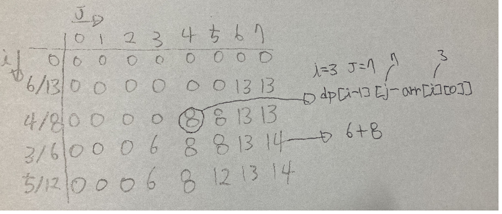

가지고 다닐 배낭 또한 최대한 가치 있게 싸려고 한다.

준서가 여행에 필요하다고 생각하는 N개의 물건

각 물건은 무게 W와 가치 V

 최대 K만큼의 무게만을 넣을 수 있는 배낭만 들고 다닐 수 있다.  `각 물건의 무게합은 K를 넘길 수 없음`

준서가 최대한 즐거운 여행을 하기 위해 배낭에 넣을 수 있는 물건들의 가치의 최댓값

이 문제에서는 짐을 쪼갤 수 없으므로 0-1 배낭 문제이고, 이는 동적 계획 알고리즘으로 풀 수 있다.

0 - 물건 i를 담지 않는다 -> 물건 1~(i-1)을 담아 용량 w인 경우 최대 가치
1 - 물건 i를 담는다 -> 물건 1~(i-1)을 담아 용량 (w-wi)인 경우 최대 가치 + 물건 i의 가치

--> 담으려면, 현재 물건에서- 실으려고하는 무게를 빼줬을 때 최대가치에 + 새로넣으려는 물건가치

**반복문을 돌면서 가치의 최대값을 찾는다.**

**무게를 넘기는지부터 확인하고,**

**만약 넘긴다면 물건을 담지 않은 `dp[i-1][j]` 값을 저장한다.**

**넘기지 않는다면 물건을 담았을 때와 담지 않았을 때의 가치를 비교해서 더 큰 값을 저장한다.**

